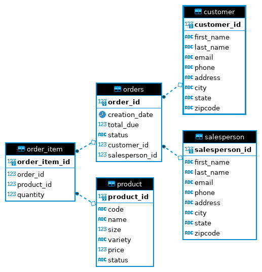

# JDBC 
## Introduction
This project follows the [Learning JDBC](https://www.linkedin.com/learning/learning-jdbc) course on LinkedInLearning.
The purpose of this project was to get familiar with how to work with JDBC and learn about various data access patterns.

Technologies used:
- Java and JDBC
- SQL
- Maven
- Docker
- PostgreSQL

## Implementation
### ER Diagram

## Design Patterns
The `Data Access Object (DAO)` pattern provides an abstraction layer between the business logic and the underlying data source.
The DAO provides an interface to the client for interacting with the database without the client needing to know the implementation details.

The `Repository Design` pattern unlike the DAO pattern focuses only on single table access per class. Instead of joining tables in the database, joins are performed in the code.
The major advantage that this pattern has over pure DAO is it is better suited for distributed databases as it allows a database to be sharded in a way that focuses on single table access instead of accessing the database as a whole.
The Repository Design pattern sits much closer to the business logic as compared to the DAO and in fact can implement DAOs to access the data.

## Test
The PostgreSQL database was populated with the sample data provided with the course. The methods for the various classes were tested manually through the `JDBCExecutor` class.
Results were printed to the terminal and compared with the results of running the SQL commands directly.