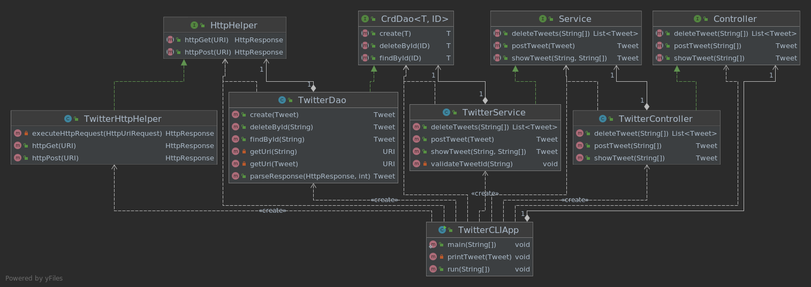

# Twitter CLI App
## Introduction
This app allows the user to post tweets, show tweets, and delete tweets from the command line. The [Apache HTTP Components](https://hc.apache.org/) library and the [Signpost OAuth](https://github.com/mttkay/signpost) library were
used to interact with and authenticate requests to the Twitter REST API. The [Jackson](https://github.com/FasterXML/jackson) library was used parse and process JSON.
Technologies used:
- Java (JUnit, Spring)
- Apache Maven
- Docker

## Quick Start
Create a Twitter Developer account and obtain the four keys and secrets: API Key, API Secret, Access Token, and Token Secret.

Package and run app using Maven
```
# build project using maven
mvn clean package

# run app
java -jar target/twitter-1.0-SNAPSHOT.jar post|show|delete [options]
```
Pull image from DockerHub
```
# pull image
docker pull cyjcao/twitter

# run docker container
docker run --rm\
-e consumerKey=YOUR_KEY \
-e consumerSecret=YOUR_SECRET \
-e accessToken=YOUR_KEY \
-e tokenSecret=YOUR_SECRET \
cyjcao/twitter post|show|delete [options]
```

## Design
### UML Diagram

This app was developed using the Model-View-Controller (MVC) architecture pattern.
- `TwitterDAO`: The data access layer handles the various models and interacts with the Twitter REST API directly to post/show/delete tweet(s) using the helper class `TwitterHttpHelper`.
- `TwitterService`: The service layer handles the business logic (i.e. makes sure tweets are within word limit). It calls `TwitterDAO` to interact with the REST API.
- `TwitterController`: The controller layer interacts with and parses the user input (CLI args). It calls `TwitterService` and returns the results.
- `TwitterCLIApp`: The main point of entry of the app. It initializes all the components, takes in the user input, and calls `TwitterController`.
### Models
This app interacts with a simplified version of the Tweet JSON object returned by the Twitter REST API.
```
// Simplified Tweet Object
{
  "created_at":,
  "id":,
  "id_str":,
  "text":,
  "entities": {
    "hashtags": [],
    "user_mentions": []
  },
  "coordinates":,
  "retweet_count":,
  "favorite_count":,
  "favorited",
  "retweeted"  
}
```
Five models were implemented to represent the above object: `Tweet`, `Entities`, `Hashtag`, `UserMention`, and `Coordinates`.

### Spring
This project managed dependencies by passing them through constructors, this technique is known as Dependency Injection and was used to make the classes loosely coupled.
However, if the project were to grow larger it becomes harder and more error-prone to manage these dependencies manually. `Spring` was used in this project to manage all dependencies automatically.
There are three configuration approaches to choose from in this project:
- `TwitterCLIBean`: Define dependency relationships using `@Bean` annotation. The Spring IoC container will automatically instantiate all Beans which were specified.
This approach still requires a lot of manual work to specify dependencies one by one.
-  `TwitterCLIComponentScan`: Use `@Autowired` annotation to tell the IoC container to inject dependency. Also specify a class as a Bean using any of the following annotations: `@Component`, `@Controller`, `@Service`, `@Repository`. 
Spring will automatically scan and registers classes as Beans which are annotated.
- `TwitterCLISpringBoot`: Dependency management using SpringBoot. 

## Test
Each component was tested using Unit Tests as well as Integration Tests written in `JUnit 4`. Unit Tests were performed using `Mockito`

## Deployment
A DockerFile was used to build a docker image of the app. The image is available on DockerHub.
```
# package app
mvn clean package

# build new docker image locally
docker build -t NAME_OF_IMAGE .
```

## Improvements
1. Allow user to show and delete tweets using search options other than tweet id such as time and/or text filters
2. Use user's current location instead of having to manually enter a latitude and longitude
3. More sophisticated options to show tweets such as all tweets from a specific user, etc.