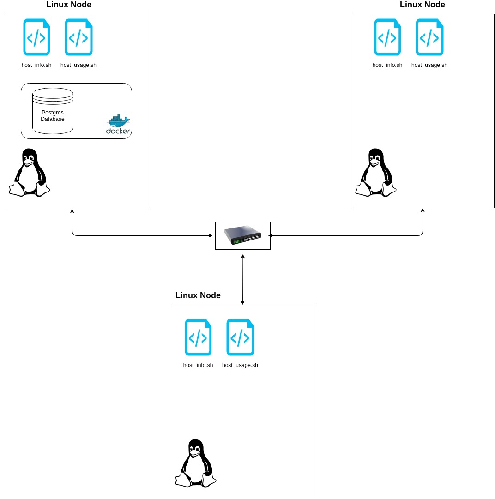

# Linux Cluster Monitoring Solution

---

## Introduction

---

The Linux Cluster Monitoring Solution (LCMA) enables the user(s) to record hardware specifications of Linux nodes and also monitor their resource usage.
The data is stored into a relational database (RDBMS) for later viewing and analysis. This solution can be used by server administration teams managing a cluster
of Linux nodes and need a way to record data for detecting node failures and/or resource planning.
LCMA uses the following technologies:
- Bash
- SQL
- PostgreSQL
- Docker

## Quick Start

---

Create a psql docker container with given username and password
```bash
# pull the latest postgres docker image
$ docker pull postgres
$ ./scripts/psql_docker.sh create psql_user psql_password
```
Start/stop a psql instance
```bash
$ ./scripts/psql_docker.sh start|stop
```
Initialize tables in the database
```bash
$ psql -h localhost -U psql_user -d db_name -f sql/ddl.sql
```
Insert hardware data into database
```bash
$ ./scripts/host_info.sh psql_host psql_port db_name psql_user psql_password
```
Insert resource usage data into database
```bash
$ ./scripts/host_usage.sh psql_host psql_port db_name psql_user psql_password
```
Setup crontab job to automate resource usage data collection
```bash
$ crontab -e
# Add the following line to crontab
* * * * * bash [path to directory]/linux_sql/scripts/host_usage.sh psql_host psql_port db_name psql_user psql_password > /tmp/host_usage.log
```
## Implementation

---

The three shell scripts, psql_docker.sh, host_info.sh, and host_usage.sh are written in bash. Their purpose and usage is described in more detail below.
ddl.sql and queries.sql are written in SQL and are run against the PostgreSQL database.

## Architecture

---



## Scripts

---

### psql_docker.sh
Manages the psql instance through creating, starting, and stopping the docker container.
```bash
# to create the container
$ ./scripts/psql_docker.sh create psql_user psql_password
# to start the container
$ ./scripts/psql_docker.sh start
# to stop the container
$ ./scripts/psql_docker.sh stop
```
### host_info.sh
Collects the hardware information of a Linux node and inserts the data into the database
```bash
$ ./scripts/host_info.sh psql_host psql_port db_name psql_user psql_password
```
### host_usage.sh
Collects resource usage of a Linux node and inserts the data into the database
```bash
$ ./scripts/host_usage.sh psql_host psql_port db_name psql_user psql_password
```
### Crontab
Automates host_usage.sh, enabling the continuous collection of resource usage data.
```bash
$ crontab -e
# Add the following line to crontab
* * * * * bash [path to directory]/linux_sql/scripts/host_usage.sh psql_host psql_port db_name psql_user psql_password > /tmp/host_usage.log
```
### queries.sql
Returns three pieces of information:
1. Group nodes by their hardware information
2. Percentage of average memory used over 5 minute intervals for each node
3. Number of data points collected over 5 minute intervals for each node. A host failure can be determined when the number of data points within an interval is less than an expected value (i.e. < 3 over 5 mins)

## Database Modeling

---

### host_info
Column Name      | Data Type   | Description
---------------- | ----------- | ------------
id               | serial      | Unique identifier (Primary Key)
hostname         | varchar     | Label used to identify a node
cpu_number       | integer     | Number of CPUs
cpu_architecture | varchar     | CPU architecture
cpu_mhz          | numeric     | CPU speed in MHz
l2_cache         | integer     | Level 2 cache in KB
total_mem        | integer     | Total usable memory in KB
timestamp        | timestamp   | Time in UTC time zone when information was taken
### host_usage
Column Name      | Data Type   | Description
---------------- | ----------- | ------------
host_id          | integer     | Identifies the host (Foreign Key references id in host_info table)
memory_free      | integer     | Amount of unused memory in KB
cpu_idle         | integer     | Percentage of time CPU spent idle
cpu_kernel       | integer     | Percentage of time CPU spent running kernel code
disk_io          | integer     | I/O in progress
disk_available   | integer     | Root directory available space in MB
timestamp        | timestamp   | Time in UTC time zone when information was taken

## Test

---

The methods used for testing were as follows:
- Manual testing of bash scripts by entering incorrect number of command line arguments and invalid arguments to observe correct error handling behaviour
- Observed output of bash commands on CLI to check for correctness before inserting to database
- 10-15 rows of dummy data were inserted into database to test correctness of SQL queries

## Improvements

---

- more robust way of detecting host failures instead of running an SQL query (i.e. through network pings)
- automating host_info.sh to run everytime there is a hardware update on the node
- prompt user to create a docker container when none exists instead of just printing an error message